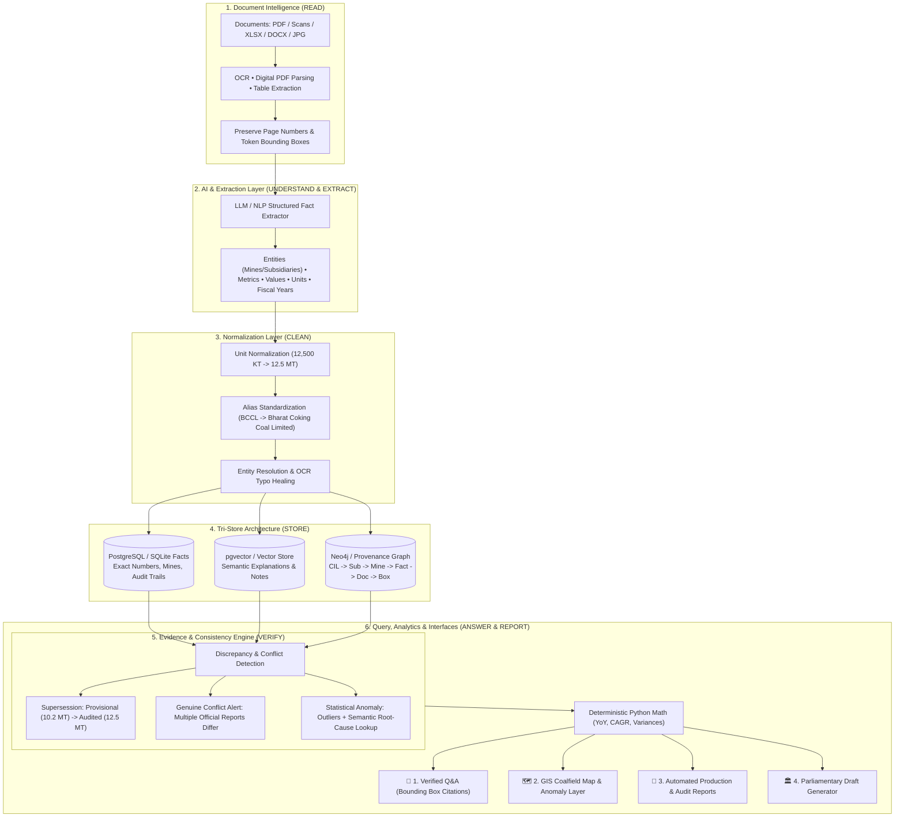

# ⛏️ MineIntel: Mining Intelligence & Evidence-Based Verification Platform

[](https://python.org)
[](https://fastapi.tiangolo.com)
[](LICENSE)
[]()

> **"Documents are the raw material → MineIntel processes them → verified, audit-backed mining intelligence comes out."**

MineIntel is an enterprise-grade Mining Intelligence platform that ingests unstructured mining documents (scans, PDFs, Excel sheets, Word files), extracts structured facts, resolves entities and units, stores data across a Tri-Store architecture (PostgreSQL, pgvector, Neo4j), and validates multi-document consistency using a deterministic **Evidence & Consistency Engine**.

---

## 🧠 The 8-Word Core Architecture

$$\mathbf{READ \longrightarrow UNDERSTAND \longrightarrow EXTRACT \longrightarrow CLEAN \longrightarrow STORE \longrightarrow VERIFY \longrightarrow ANSWER \longrightarrow REPORT}$$



---

## 🗄️ Tri-Store Architecture

| Database Store | Purpose | Example Query |
| :--- | :--- | :--- |
| **🟦 PostgreSQL / SQL** | **"What is the exact data?"** | *"What was Mine A's production in 2023?"* $\to$ **12.5 MT** (Zero Hallucination) |
| **🟨 pgvector / Vectors** | **"Where is the explanation?"** | *"Why did output decrease?"* $\to$ Matches *"equipment downtime & pit floods"* |
| **🟩 Neo4j / Graph** | **"How is it connected?"** | Traces lineage: $\text{CIL} \to \text{BCCL} \to \text{Mine A} \to \text{Document} \to \text{Bounding Box}$ |

---

## ⚡ Key Features

1. **Deterministic Anti-Hallucination Engine:** All arithmetic (CAGR, growth percentages, sums, variances) is computed strictly in Python code.
2. **Automated Supersession Resolution:** Automatically replaces provisional flash figures with final statutory audited numbers while maintaining an audit trail.
3. **Genuine Conflict Triage:** Detects when two authoritative official reports disagree and flags them for human officer verification.
4. **Statistical Anomaly Detection:** Detects $+150\%$ spikes and $-35\%$ drops, querying pgvector to explain the operational root cause.
5. **Interactive GIS Map:** Real-time spatial tracking of Indian coalfields (Jharkhand, Odisha, Chhattisgarh, MP, Maharashtra, WB) with anomaly rings and conflict flags.
6. **Parliamentary Statement Generator:** Formulates official Ministry of Coal replies for Lok Sabha / Rajya Sabha with Annexure tables and an **Officer Sign-Off Workflow** (*AI drafts, Human approves*).

---

## 🚀 Quick Start (Local Setup)

### 1. Clone the repository
```bash
git clone https://github.com/AbhinavThammineni/MineIntel.git
cd MineIntel
```

### 2. Install dependencies
```bash
pip install -r backend/requirements.txt
```

### 3. Seed demo intelligence database
```bash
cd backend
python seed_data.py
```

### 4. Start the server
```bash
python -m uvicorn app.main:app --host 0.0.0.0 --port 8000
```
Open **[http://localhost:8000](http://localhost:8000)** in your browser.

---

## 🧪 Running Automated Tests

```bash
python -m pytest tests -v
```
*All 9 unit & integration tests covering extraction, normalization, conflict resolution, supersession, and CAGR math pass with 100% success rate.*

---

## 🐳 Docker Deployment

```bash
docker compose up -d --build
```

---

## 📜 License
MIT License. Developed for Advanced Mining Intelligence and Evidence Verification.
